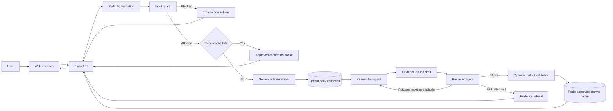
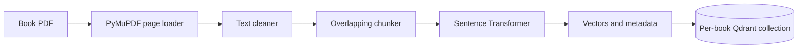

# BookMind

BookMind is an evidence-grounded, multi-agent question-answering application for books. A user selects a book, asks a question, and receives an answer only when the response can be supported by passages retrieved from that book.

The system combines retrieval-augmented generation (RAG), a LangGraph researcher/reviewer workflow, NeMo Guardrails, typed API contracts, Qdrant vector search, and Redis caching. Unsupported or unsafe requests are blocked or refused instead of being answered from the model's general knowledge.


## Contents

- [Key capabilities](#key-capabilities)
- [Technology stack](#technology-stack)
- [System architecture](#system-architecture)
- [Request lifecycle](#request-lifecycle)
- [Safety architecture](#safety-architecture)
- [Data ingestion architecture](#data-ingestion-architecture)
- [Project structure](#project-structure)
- [Running with Docker](#running-with-docker)
- [Running locally](#running-locally)
- [Ingesting books](#ingesting-books)
- [Configuration](#configuration)
- [API reference](#api-reference)
- [Testing and evaluation](#testing-and-evaluation)
- [Troubleshooting](#troubleshooting)
- [Production considerations](#production-considerations)

## Key capabilities

- Answers questions using only evidence retrieved from the selected book.
- Returns page-aware source passages and similarity scores.
- Uses separate researcher and reviewer agents to reduce unsupported claims.
- Allows one bounded revision when the reviewer rejects a draft.
- Refuses an answer when sufficient evidence cannot be established.
- Blocks prompt injection, unrelated requests, cross-book questions, and library modification requests.
- Treats book content as untrusted data rather than executable instructions.
- Caches only reviewer-approved answers.
- Supports page-specific questions such as `What is discussed on page 25?`.
- Provides a responsive web interface and JSON API.
- Handles simple greetings without sending them through evidence retrieval.

## Technology stack

| Layer | Technology | Responsibility |
| --- | --- | --- |
| Web interface | HTML, CSS, vanilla JavaScript | Book selection, chat interface, sources, verdicts, and pipeline status |
| Web/API server | Flask, Gunicorn | Serves the application and exposes REST endpoints |
| Validation | Pydantic | Validates request and response contracts |
| Agent orchestration | LangGraph | Coordinates retrieval, drafting, review, revision, and refusal |
| LLM provider | Groq | Produces structured researcher and reviewer outputs |
| Safety | NeMo Guardrails, Colang, deterministic Python checks | Detects unsafe, off-topic, cross-book, and prohibited administrative requests |
| Embeddings | Sentence Transformers | Converts questions and book chunks into normalized vectors |
| Vector database | Qdrant | Stores and retrieves semantically similar book passages |
| Cache | Redis | Stores approved answers using versioned SHA-256 keys |
| PDF processing | PyMuPDF | Extracts page-level text from book PDFs |
| Testing/evaluation | pytest, pytest-cov, RAGAS | Unit, integration, workflow, guardrail, and RAG quality evaluation |
| Deployment | Docker, Docker Compose | Runs the app, Qdrant, and Redis as a complete stack |

## System architecture



### Application layers

1. **Presentation layer** — `templates/` and `static/` render the library and chat experience.
2. **API layer** — Flask routes expose books, chat, and service health.
3. **Validation and safety layer** — Pydantic, deterministic checks, and NeMo Guardrails validate every request before retrieval.
4. **Orchestration layer** — LangGraph manages the researcher/reviewer state machine.
5. **AI service layer** — Groq provides JSON-formatted model completions; Sentence Transformers generates embeddings.
6. **Data layer** — Qdrant stores book vectors and Redis stores approved responses.
7. **Ingestion layer** — PDF loading, cleaning, chunking, embedding, and batch upsert prepare the searchable corpus.

## Request lifecycle

### 1. Request validation

`POST /api/chat` accepts a `book_id` and `question`. Pydantic rejects malformed identifiers, empty questions, unsupported control characters, extra fields, and oversized input.

### 2. Input safety checks

The input guard runs before cache lookup, vector search, or any answer-generation call. It checks:

- Empty and oversized input.
- Destructive or administrative library actions.
- Prompt-injection attempts.
- Off-topic requests.
- Unknown book identifiers.
- Questions that explicitly target a different book.

### 3. Approved-answer cache

Redis is checked using a SHA-256 key derived from:

```text
book_id | normalized_question | corpus_version
```

This prevents answers from leaking between books and automatically isolates stale cache entries after a corpus-version change. Cache failures are non-fatal; the request continues through the RAG workflow.

### 4. Evidence retrieval

The question is embedded with the configured Sentence Transformer model. Qdrant searches only the collection belonging to the selected book:

```text
<QDRANT_COLLECTION>_<book_id>
```

Retrieval uses cosine similarity, a configurable result limit, and a minimum score threshold. If a page number is present in the question, Qdrant applies an exact page filter and disables the similarity threshold for that search.

### 5. Researcher agent

The researcher receives the question and retrieved passages. Its prompt requires it to:

- Use only the supplied evidence.
- Treat retrieved text as untrusted data.
- Avoid facts from model memory.
- Cite source indexes inline.
- Return a strict JSON object containing the answer and citations.

### 6. Reviewer agent

The reviewer compares every meaningful claim in the draft against the retrieved passages. A response passes only when its claims and citations are supported.

```text
Researcher draft → Reviewer PASS → Return and cache answer
                 → Reviewer FAIL → Revise once → Review again
                 → Final FAIL    → Refuse answer
```

The number of revision attempts is controlled by `MAX_REVISION_COUNT`.

### 7. Output validation

The final payload is validated as a typed `ChatResponse`. Only approved responses are written to Redis. Blocked and refused responses are never cached.

## Safety architecture

BookMind uses layered controls instead of relying on a single model prompt.

### Deterministic controls

- Strict request schemas and length limits.
- Prompt-injection pattern detection when NeMo is unavailable.
- A read-only boundary that always blocks requests to delete, add, upload, replace, rename, edit, or otherwise modify books and library data.
- Catalog validation and cross-book scope checks.
- Citation-index validation before sources are returned.
- Typed output validation before API serialization.

### NeMo Guardrails

When `GROQ_API_KEY` is configured, `NemoGuard` loads the Colang rules in `nemo_config/`. The rails classify and block:

- Prompt-injection attempts.
- Unrelated requests.
- Destructive or administrative library actions.

Example prohibited request:

```text
Delete this book
```

Response:

```text
I’m sorry, but I can’t delete or modify books or library data. BookMind is a
read-only assistant; I can help you explore and understand the selected book instead.
```

### Evidence controls

- The researcher cannot use general model knowledge.
- Retrieved text is explicitly treated as untrusted evidence.
- Missing evidence produces a refusal rather than a speculative answer.
- The reviewer checks support for claims and citations.
- Only reviewer-approved responses can enter the cache.

These controls reduce common failure modes but are not a complete security boundary. See [Production considerations](#production-considerations) before exposing the service publicly.

## Data ingestion architecture



The ingestion pipeline:

1. Extracts text and page numbers with PyMuPDF.
2. Normalizes whitespace, line breaks, soft hyphens, and hyphenated line wrapping.
3. Creates approximately 260-word chunks with a 45-word overlap.
4. Generates normalized document embeddings in batches.
5. Creates a per-book Qdrant collection with cosine distance and INT8 scalar quantization.
6. Upserts vectors with title, author, page, chapter, chunk ID, and text metadata.

Re-running ingestion uses deterministic UUIDs for the same chunk identifiers, allowing existing points to be updated.

## Project structure

```text
bookmind-project/
├── app/
│   ├── api/                 # Books, chat, and health endpoints
│   ├── guardrails/          # Input, NeMo, and output safety controls
│   ├── models/              # Pydantic request and response contracts
│   ├── rag/                 # LangGraph workflow, agents, prompts, and state
│   ├── services/            # Groq, embeddings, Qdrant, and Redis adapters
│   ├── __init__.py          # Flask application factory
│   ├── catalog.py           # Available book metadata
│   ├── config.py            # Environment-backed settings
│   └── main.py              # Local application entry point
├── data/                    # Local source PDFs; mounted read-only in Docker
├── nemo_config/
│   ├── bookmd.co            # Colang intents, responses, and flows
│   └── config.yml           # NeMo model and rail configuration
├── scripts/
│   ├── evaluation/          # 100-case dataset and RAGAS runner
│   └── ingestion/           # PDF loading, cleaning, chunking, and indexing
├── static/                  # CSS, JavaScript, and image assets
├── templates/               # Flask HTML templates
├── tests/                   # Unit and integration test suite
├── .env.example             # Configuration template
├── docker-compose.yml       # App, Redis, and Qdrant services
├── Dockerfile               # Gunicorn production-style container
├── requirements.txt         # Runtime dependencies
└── requirements-dev.txt     # Test and evaluation dependencies
```

## Running with Docker

This is the simplest way to run the complete stack.

### Prerequisites

- Docker Engine with Docker Compose v2
- A Groq API key
- Sufficient memory to load the configured Sentence Transformer model

### 1. Configure the environment

```bash
cp .env.example .env
```

Edit `.env` and set at least:

```dotenv
SECRET_KEY=replace-with-a-long-random-value
GROQ_API_KEY=your-groq-api-key
```

Never commit `.env` or expose API keys in screenshots, logs, or documentation.

### 2. Build and start the stack

```bash
docker compose up --build -d
```

This starts:

- BookMind on `http://localhost:5000`
- Qdrant on `http://localhost:6333`
- Redis inside the Compose network

Check service status:

```bash
docker compose ps
curl http://localhost:5000/api/health
```

View application logs:

```bash
docker compose logs -f app
```

### 3. Ingest the books

The application can start before ingestion, but it cannot answer grounded questions until the selected book has a Qdrant collection. See [Ingesting books](#ingesting-books).

### 4. Stop the stack

```bash
docker compose down
```

Redis and Qdrant data remain in named Docker volumes. To inspect the volumes:

```bash
docker volume ls
```

## Running locally

Use this setup when developing the Flask application on the host while Redis and Qdrant run in Docker.

### Prerequisites

- Python 3.12
- Docker Engine with Docker Compose v2
- A Groq API key

### 1. Create the virtual environment

```bash
python3.12 -m venv .venv
source .venv/bin/activate
python -m pip install --upgrade pip
python -m pip install -r requirements.txt
```

### 2. Configure environment variables

```bash
cp .env.example .env
```

Set `GROQ_API_KEY` and replace `SECRET_KEY`. The example file already uses host-accessible service URLs:

```dotenv
QDRANT_URL=http://localhost:6333
REDIS_URL=redis://localhost:6379/0
```

### 3. Start Qdrant and Redis

```bash
docker compose up -d qdrant redis
```

### 4. Ingest the books

Follow the commands in [Ingesting books](#ingesting-books) before asking content questions.

### 5. Start Flask

```bash
python -m app.main
```

Open `http://localhost:5000`.

For a non-debug local server, use Gunicorn:

```bash
gunicorn --bind 0.0.0.0:5000 --workers 2 --threads 4 'app:create_app()'
```

## Ingesting books

Only ingest books that you are legally permitted to process.

### Local Python environment

With Qdrant running at `http://localhost:6333`:

```bash
python -m scripts.ingestion.ingest data/meditationsofmar00marc.pdf \
  --book-id meditations \
  --title "Meditations" \
  --author "Marcus Aurelius"

python -m scripts.ingestion.ingest data/The_Art_Of_War.pdf \
  --book-id the_art_of_war \
  --title "The Art of War" \
  --author "Sun Tzu"

python -m scripts.ingestion.ingest data/rich_dad_poor_dad.pdf \
  --book-id rich_dad_poor_dad \
  --title "Rich Dad Poor Dad" \
  --author "Robert T. Kiyosaki"
```

The first run downloads the configured embedding model and can take several minutes.

### Docker environment

The Compose file mounts `./data` at `/app/data` inside the application container:

```bash
docker compose exec app python -m scripts.ingestion.ingest /app/data/meditationsofmar00marc.pdf \
  --book-id meditations \
  --title "Meditations" \
  --author "Marcus Aurelius"
```

Repeat the command with the corresponding paths and metadata for the other catalog books.

### Adding a catalog entry

Ingestion creates searchable data but does not automatically add a new book to the web interface. To introduce another book during development:

1. Add its metadata to `app/catalog.py`.
2. Add its cover image to `static/images/`.
3. Ingest its PDF using the exact same `book_id`.
4. Increment `CORPUS_VERSION` if existing cached answers should be invalidated.

BookMind's public chat interface remains read-only; users cannot perform these administrative actions through chat.

## Configuration

Settings are loaded from `.env` through `pydantic-settings`.

| Variable | Default | Description |
| --- | --- | --- |
| `APP_ENV` | `development` | Enables Flask debug mode when running `app.main` |
| `SITE_ORIGIN` | `http://localhost:5000` | Public application origin |
| `SECRET_KEY` | `change-me` | Application secret; replace outside local development |
| `GROQ_API_KEY` | empty | Required for NeMo, researcher, and reviewer LLM calls |
| `GROQ_MODEL` | `llama-3.1-8b-instant` | Researcher model served by Groq |
| `GROQ_REVIEWER_MODEL` | `llama-3.1-8b-instant` | Reviewer model served by Groq |
| `EMBEDDING_MODEL` | `BAAI/bge-small-en-v1.5` | Sentence Transformer used for queries and documents |
| `QDRANT_URL` | `http://qdrant:6333` in code | Qdrant endpoint; use `localhost` for host development |
| `QDRANT_API_KEY` | empty | Optional Qdrant API key |
| `QDRANT_COLLECTION` | `book_chunks` | Prefix for per-book collection names |
| `REDIS_URL` | `redis://redis:6379/0` in code | Redis endpoint; use `localhost` for host development |
| `DEMO_MODE` | `false` | Uses the bundled PDFs and credential-free extractive answers when enabled |
| `CACHE_TTL_SECONDS` | `86400` | Approved-answer cache lifetime in seconds |
| `CORPUS_VERSION` | `v1` | Cache namespace version; increment after corpus changes |
| `RETRIEVAL_TOP_K` | `5` | Maximum retrieved passages per search |
| `RETRIEVAL_SCORE_THRESHOLD` | `0.36` | Minimum semantic similarity score |
| `MAX_QUESTION_CHARS` | `1200` | Input guard question-length limit |
| `MAX_REVISION_COUNT` | `1` | Maximum researcher revisions after reviewer failure |

Set `DEMO_MODE=true` to use the bundled PDFs through the read-only local retriever. When no Groq API key is configured, BookMind returns a conservative cited extract instead of calling an external model. With `DEMO_MODE=false`, Qdrant remains the primary retriever and the bundled PDFs are used only when the selected collection is unavailable or returns no evidence.

When changing `EMBEDDING_MODEL`, recreate and re-ingest the Qdrant collections because vector dimensions may differ.

## API reference

### `GET /`

Returns the web application.

### `GET /api/books`

Returns the configured catalog:

```json
{
  "books": [
    {
      "id": "meditations",
      "title": "Meditations",
      "author": "Marcus Aurelius"
    }
  ]
}
```

Additional presentation fields are included in the actual response.

### `POST /api/chat`

Request:

```bash
curl --request POST http://localhost:5000/api/chat \
  --header 'Content-Type: application/json' \
  --data '{
    "book_id": "meditations",
    "question": "What can we control?"
  }'
```

Successful grounded response:

```json
{
  "answer": "An evidence-grounded answer with inline citations [1].",
  "sources": [
    {
      "chunk_id": "meditations-p12-c8",
      "page": 12,
      "chapter": null,
      "text": "Retrieved source passage...",
      "score": 0.87
    }
  ],
  "review_verdict": "approved",
  "review_feedback": "Grounded.",
  "cached": false,
  "pipeline": [
    "Input validated",
    "Retrieved 5 passages",
    "Researcher drafted an evidence-bound answer",
    "Reviewer verdict: PASS",
    "Grounded answer approved"
  ]
}
```

`review_verdict` can be:

- `approved` — supported by evidence and eligible for caching.
- `refused` — evidence review did not establish a safe answer.
- `blocked` — the input guard rejected the request before retrieval.

### `GET /api/health`

```json
{
  "status": "ok",
  "service": "bookmind",
  "corpus_version": "v1"
}
```

The health endpoint confirms that Flask is running; it does not currently perform deep Redis, Qdrant, Groq, or embedding-model readiness checks.

## Testing and evaluation

### Install development dependencies

```bash
python -m pip install -r requirements-dev.txt
```

### Run the complete test suite

```bash
pytest
```

### Run with coverage

```bash
pytest --cov --cov-report=term-missing
```

The tests cover:

- API schema validation and endpoints.
- Cache normalization, isolation, expiry writes, and failure behavior.
- PDF chunking behavior.
- Prompt-injection, scope, and read-only guardrails.
- NeMo response parsing without external API calls.
- Researcher/reviewer approval, revision, and refusal paths.
- The guarantee that blocked requests never reach retrieval.
- The guarantee that refused responses are not cached.
- The 100-case evaluation dataset structure.

### RAGAS evaluation

The evaluation dataset is stored at `scripts/evaluation/dataset.json` and contains 100 cases across answerable, paraphrased, unsupported, wrong-book, prompt-injection, adversarial, and system behavior categories.

Populate each case's `answer` and `contexts` by running it against an ingested corpus, then execute:

```bash
python -m scripts.evaluation.evaluate_rag
```

The runner measures faithfulness, answer relevancy, context precision, and context recall. It refuses to produce results when answers and contexts have not been populated, preventing fabricated benchmark output.

## Troubleshooting

### Port 5000 is already in use

Find the existing process or start on another port:

```bash
flask --app 'app:create_app()' run --port 5001
```

If the port changes, also update `SITE_ORIGIN`.

### The app returns insufficient-evidence responses

Confirm that:

- Qdrant is running.
- The selected book was ingested with the same `book_id` used in `app/catalog.py`.
- The expected collection exists, for example `book_chunks_meditations`.
- `RETRIEVAL_SCORE_THRESHOLD` is appropriate for the embedding model and corpus.

### Qdrant or Redis cannot be reached

For local Flask development, use `localhost` URLs. Inside Docker Compose, use the service names `qdrant` and `redis`.

```bash
docker compose ps
docker compose logs qdrant
docker compose logs redis
```


## Author

Created by [Mohamed Ayman Abdelaty](https://www.linkedin.com/in/mohamed-ayman-abdelaty/).
